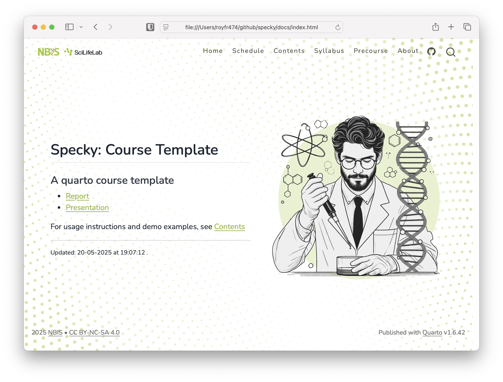
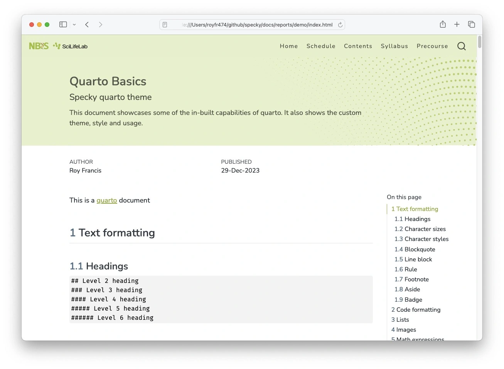
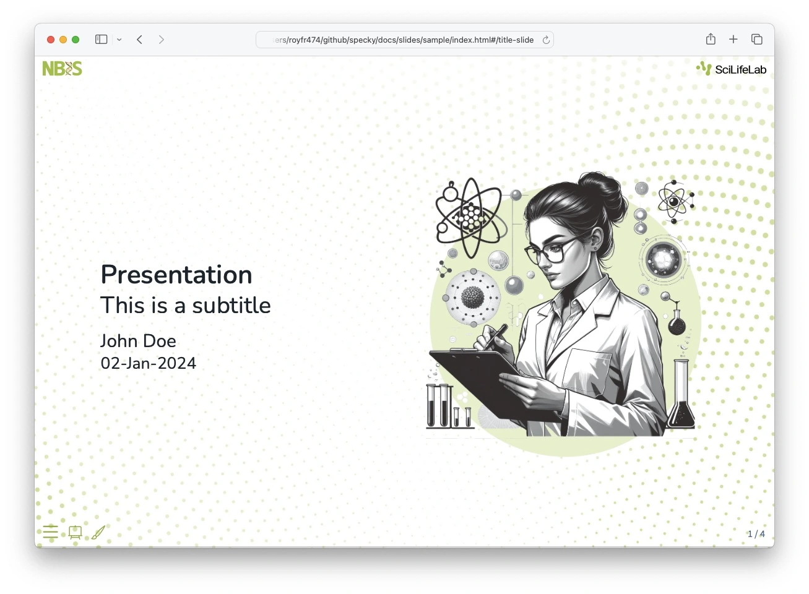

# specky

[](https://github.com/royfrancis/specky/actions?workflow=deploy)  [](https://github.com/royfrancis/specky/actions?workflow=linkcheck)  [](https://lifecycle.r-lib.org/articles/stages.html#experimental)

Quarto website template for courses







For a demo site and usage, see [here](https://royfrancis.github.io/specky).

## Usage

- Recommended quarto 1.6.43 or higher
- To download and use a starter template, run in the terminal

:exclamation: Demo files are not downloaded

```
quarto use template royfrancis/specky
```

- Render all html files into `docs` directory to make sure everything works as expected

```
quarto render
```

- Use `##` as the highest level heading.
- Limited documentation is available on the [demo site](https://royfrancis.github.io/specky/home_contents.html) for customization

## Showcase

Here are a few examples of this template in action:

- [Introduction to Bioinformatics using NGS data](https://nbisweden.github.io/workshop-ngsintro/2511/)
- [Single-cell RNA-seq analysis](https://nbisweden.github.io/workshop-scRNAseq/)
- [Tools for reproducible research](https://nbisweden.github.io/workshop-reproducible-research/)
- [Advanced data visualization](https://nbisweden.github.io/workshop-data-visualization-r/2505/)

## Acknowledgements

- Built using [Quarto](https://quarto.org/)
- Uses the [fontawesome extension](https://github.com/quarto-ext/fontawesome) for icons
- Uses the [reveal-logo extension](https://github.com/royfrancis/reveal-logo) for logos in presentation 

---

2025 • Roy Francis
